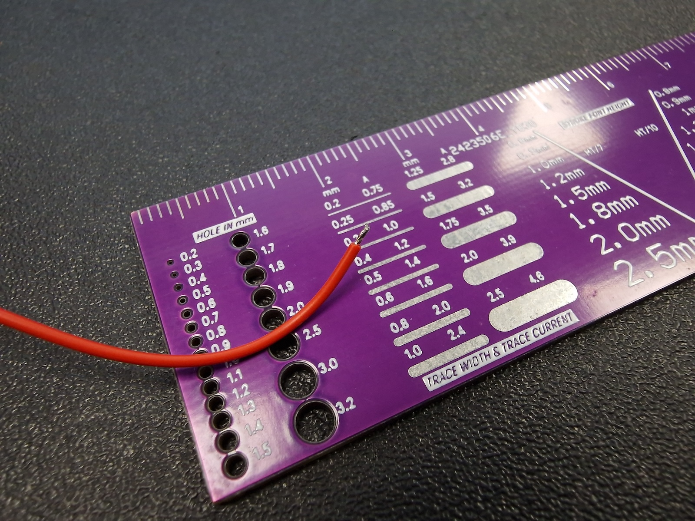

# Inkplate Time Logger Device - Assembly Instructions 🕑 🛠️ 🔧
In this readme, you will find everything needed to assemble the device with the provided case.

## Needed Materials 📦
- [Soldered Inkplate 6 without case - 333232](https://solde.red/333232)  
- [Soldered RFID 125 kHz Breakout for UART - 333154](https://solde.red/333154)  
- [125 kHz RFID tags](https://solde.red/108789)  
- [Red prototyping wire](https://solde.red/333337)  
- [Black prototyping wire](https://solde.red/333338)  
- [White or yellow prototyping wire](https://solde.red/333339)  
- [Generic NMOS transistor in SOT23-3 case](https://solde.red/101349)  
- [330R SMD resistor in 0603 case](https://solde.red/101807)  
- [10k SMD resistor in 0603 case](https://solde.red/101307)  
- Schottky or [Silicon Diode](https://solde.red/101889)  
- [Electromagnetic buzzer](https://solde.red/101247) or similar 🔊  
- *Optional* [IPX to SMA adapter](https://solde.red/108591)  
- *Optional* [2.4 GHz SMA Antenna](https://solde.red/108948) or similar 📡  
- *Optional* [IPX connector](https://solde.red/108942) or similar  
- 3D printed case 🖨️  
- microSD Card with maximum capacity of 32GB. Must be formatted as FAT32! 💾

## Needed Tools 🔨
- Soldering iron or soldering station with a fine tip 🔥  
- [Soldering wire](https://solde.red/333057)  
- *Optional* [Tweezers](https://solde.red/108319)  
- [Solder Wick](https://solde.red/101697) *(if things do not go as planned)*  
- Double-sided tape (2mm foam double-sided tape) 
- Lots of patience 🧘‍♂️  
- USB-C cable 🔌  
- *Optional* [USB power supply 5V 2A](https://solde.red/100717) 🔌  
- [Cutting pliers](https://solde.red/100386) ✂️

## Assembly Instructions 📋
1. Print the desired case; there are two options: with an external WiFi antenna for better reception or without an external antenna. We chose the external antenna for more reliable connection. 🖨️  
2. Compile the sketch! Download all needed libraries and set all settings described [here](https://github.com/SolderedElectronics/Workhours-Device-Inkplate6?tab=readme-ov-file#getting-started). 📂  
3. Place the antenna inside the case. **NOTE**: The fit is very tight, so be careful not to damage the antenna. We also used a ferrite pad for better RFID reception, but this is optional. 🧢  

     
     

4. Snip the wires of the RFID connector on the breakout PCB so you can easily tape the breakout to the case. ✂️  
5. Cut a piece of double-sided tape the same size as the RFID breakout and tape it inside the case (see image).  

     

6. Connect the RFID antenna and RFID breakout.  
7. Close the RFID antenna. **NOTE**: Since everything is a tight fit, be very careful not to damage the RFID antenna while closing it!  

     

8. Cut three wires for the RFID about 15cm long. Use red for RFID supply, black for `GND`, and white, yellow, or any other color for the UART.  

     
     

9. Remove a few millimeters of insulation from both sides of the wires.  

     

10. Pre-tin the wires for easier soldering.  

      

11. Solder the black wire to `GND`, red to `VCC`, and white or yellow to `TXD` on the RFID breakout.  

      

12. Change the baud rate of the RFID breakout by switching DIP switches 1 and 3 to the ON position.  

      

13. Solder the red wire from the RFID to `VIN`, black to `GND`, and yellow or white to `GPIO39` on the Inkplate 6.  

      
      

14. Cut the wires on the buzzer and add a diode. **NOTE**: Watch the polarity! The anode must be connected to `-` and the cathode to `+` of the buzzer. Also, cut sticky tape if needed to fix the buzzer in place. Wrap it around the buzzer.  

      
      

15. Cut one black and one red wire 15cm long. Remove insulation and pre-tin them as before. These will be used for the buzzer.  
16. Solder the red wire to the `+` of the buzzer and the black wire to the `-`.  

      

17. Now comes the tricky part! Solder a few SMD components. You can use THT components, but they need to be fixed in position with hot glue or something similar.  
    - First, solder the `NMOS` to the GND on the Inkplate's `GPIO Expander 1` header.  
    - Connect a `10k` resistor between the bottom two pads of the NMOS (Gate and Source).  
    - Solder one pad of the `330R` to `P1-7`.  
    - Use a thin wire to connect the second pad of the `330R` to the Gate of the `NMOS`.  
    - Connect the black wire of the buzzer to the upper pad of the `NMOS` (Drain). **NOTE**: Be careful with the wire! Pulling it can damage the transistor.  
    - Connect the red wire of the buzzer to the `3V3` pad on the Inkplate.  

      

      

### Optional - Adding an External Antenna 📡
If the WiFi signal reception is poor, you can boost it by adding an external WiFi antenna. This requires advanced SMD soldering skills.  

1. Remove the old solder from the IPX solder pads on the ESP32 and alternate resistor pads.  
2. Move the ESP32 Antenna 0R resistor to the alternate position. Use steady hands, a fine soldering tip, and good SMD tweezers.  
3. Solder the IPX connector. **NOTE**: Avoid getting solder into the connector itself. Solder the center pad first, then the GND pads. Be careful with connector orientation! Do not solder the pin marked with a red `X` to the center pad.  

      

4. Screw the IPX to SMA adapter to the case.  
5. Connect the IPX to SMA adapter to the ESP32.  
6. Screw the antenna onto the SMA
